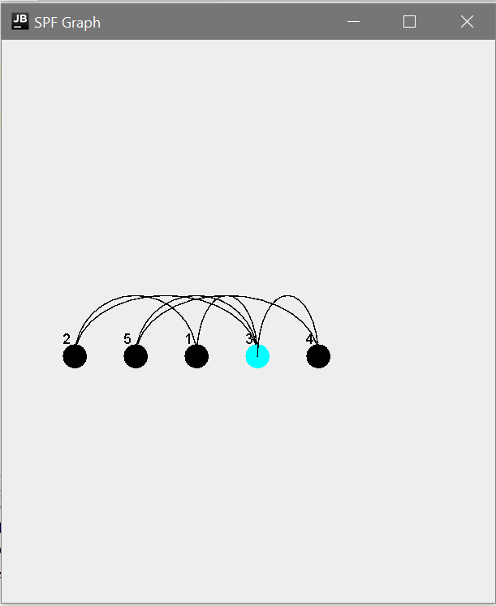

# SPF Finder Project

## How it Works
This Java application will search through a graph (built off an input file), and show a visual representation of the SPFs.

An SPF is defined as a node which connects at least two distinct subgraphs.

## How to Use
To use, pass the name of the input file (provided as input.in.txt) as a command line argument.

